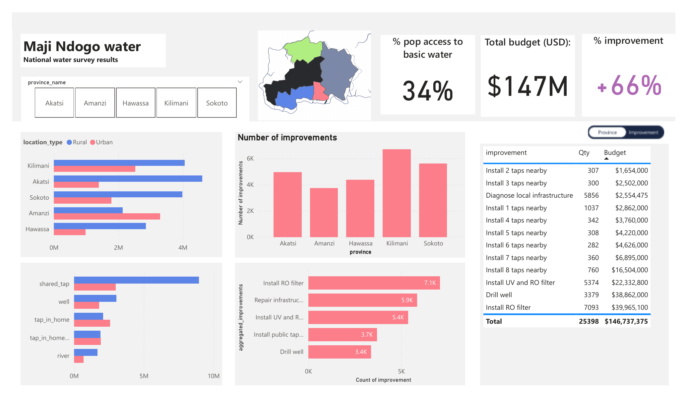
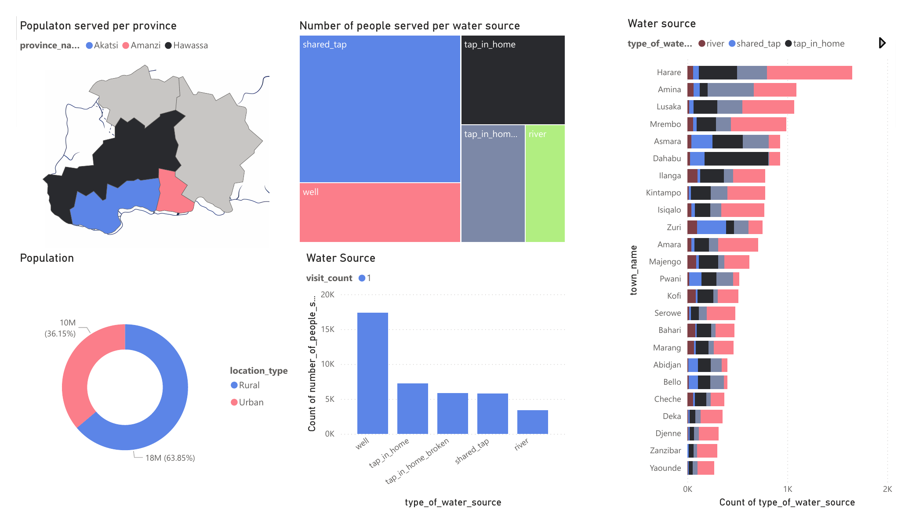
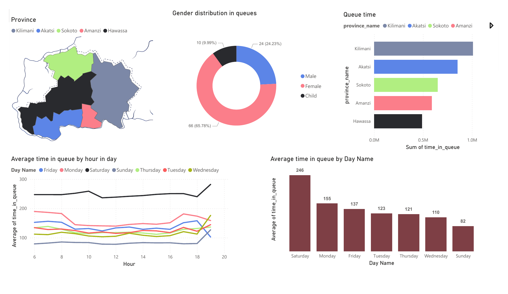
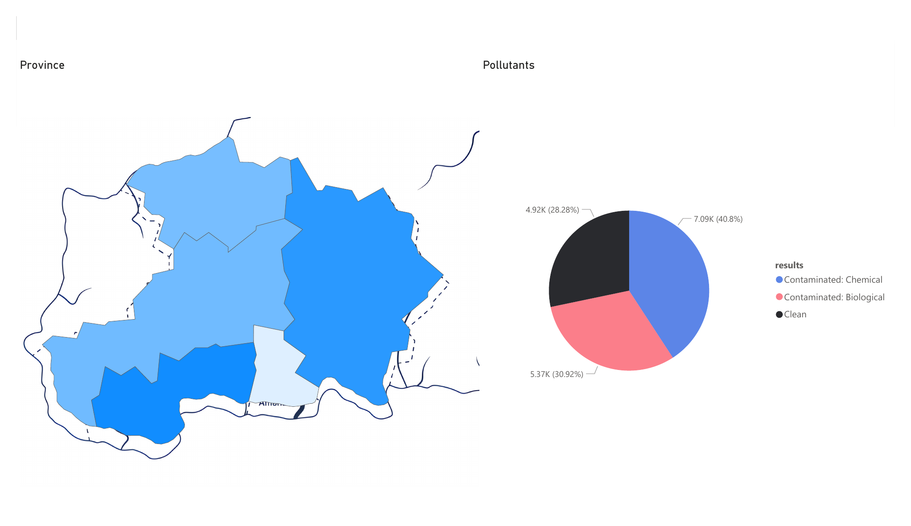
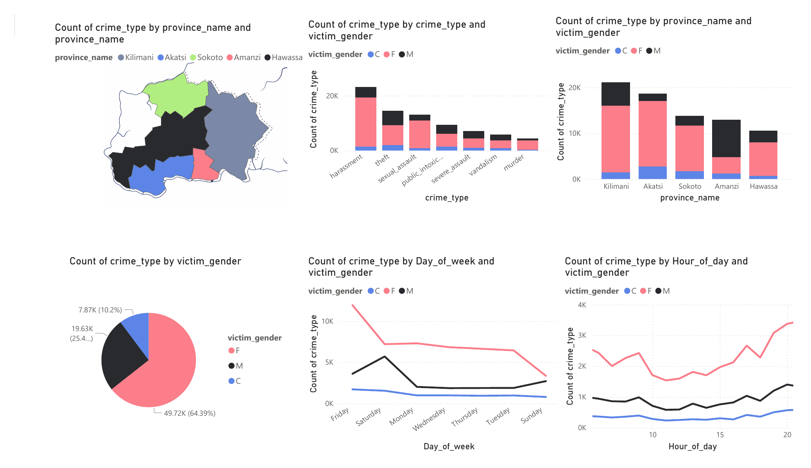
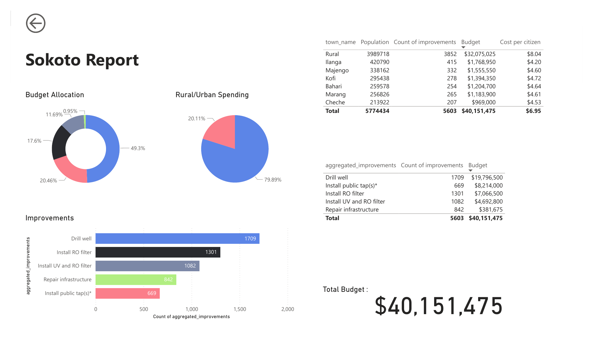
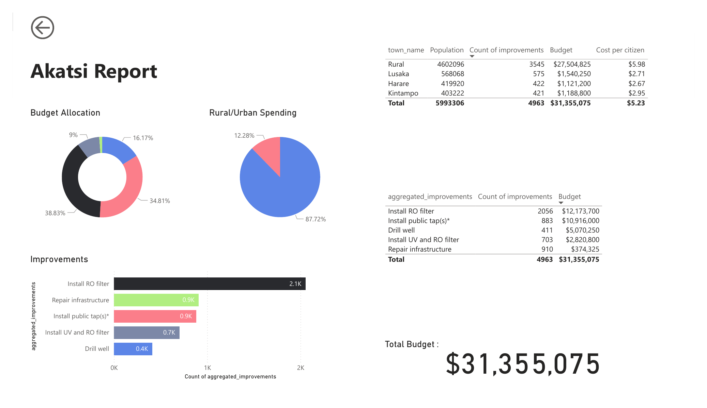
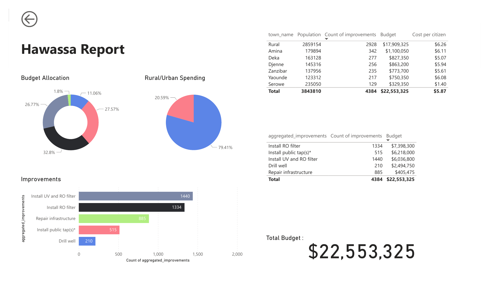
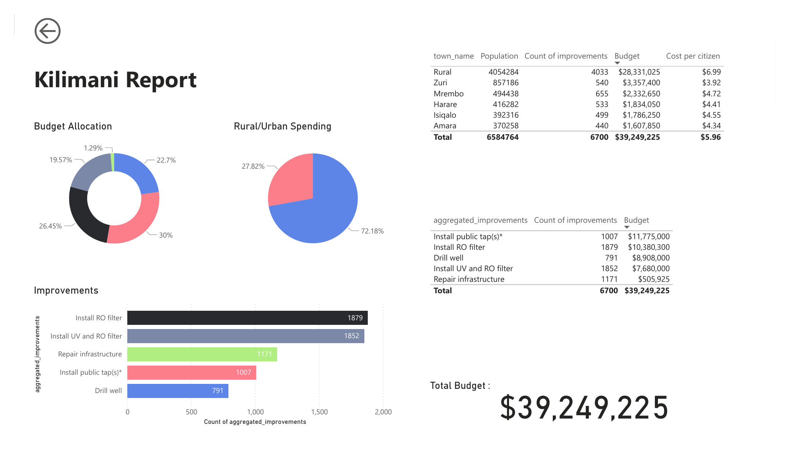
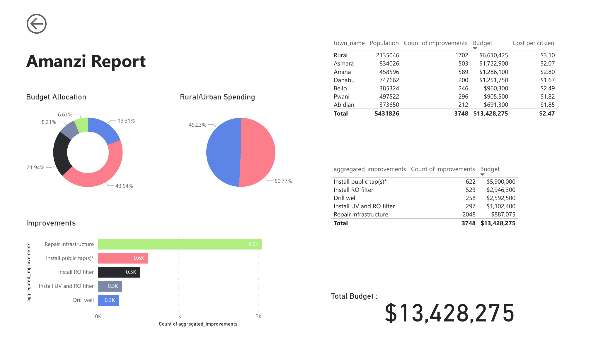

# 💧 Maji Ndogo — National Water Access & Infrastructure Analysis

> A comprehensive Power BI data analysis project examining water access, quality, safety, and improvement planning across the five provinces of Maji Ndogo.

---

## Project Overview

This project presents a multi-page Power BI dashboard analyzing the water crisis in the fictional nation of **Maji Ndogo**, covering:

- Population distribution and water source types
- Queue times and gender dynamics at water collection points
- Water quality and contamination testing results
- Crime and safety data around water collection
- Province-level infrastructure improvement plans and budget allocation

The goal is to identify the most critical interventions needed to bring **basic water access** to the ~66% of the population currently underserved, within a **total national budget of ~$147M USD**.

---

## Dashboard Pages

### Page 1 — National Improvement Plan Summary



> **Overview page** — start here for a high-level summary of the entire project.

The consolidated national plan for infrastructure upgrades:

| Metric | Value |
|---|---|
| Current population with basic water access | **34%** |
| Projected improvement after interventions | **+66%** |
| Total national budget required | **$147M USD** |
| Total improvement actions planned | **25,398** |

**Top improvement types by count:**
| Improvement | Quantity | Budget |
|---|---|---|
| Install RO filter | 7,093 | $39,965,100 |
| Drill well | 3,379 | $38,862,000 |
| Install UV and RO filter | 5,374 | $22,332,800 |
| Install public tap(s) | ~3,696 | ~$19,157,000 |
| Diagnose local infrastructure | 5,856 | $2,554,475 |

---

### Page 2 — Water Sources Overview



An introduction to water access across three highlighted provinces (Akatsi, Amanzi, Hawassa). Key findings:

- **18M people (63.85%)** live in rural areas; **10M (36.15%)** in urban areas
- The most common water source is the **well** (~17,000 count), followed by tap-in-home and shared taps
- **Shared taps** serve the largest number of people in aggregate
- City-level breakdown shows most towns rely on a mix of river, shared tap, and tap-in-home sources
- Towns like **Harare** and **Amina** have the highest absolute count of water source installations

---

### Page 3 — Queue Time & Demographics



Analyzes how long citizens wait to collect water, broken down by time of day, day of week, province, and gender.

- **Saturday** has the highest average queue time (246 minutes — over 4 hours)
- **Sunday** has the lowest average queue time (82 minutes)
- Queue times are **remarkably consistent throughout the day** (6am–8pm), suggesting chronic infrastructure insufficiency rather than peak-hour congestion
- **65.78% of people in queues are female**, 24.23% male, and 9.99% children — highlighting the disproportionate burden on women and girls
- **Kilimani** province records the highest total queue time burden, followed by Akatsi

---

### Page 4 — Water Quality & Contamination



Results from water source testing across all provinces:

- Only **28.28% (4.92K)** of tested sources are **Clean**
- **40.8% (7.09K)** are **Contaminated: Chemical**
- **30.92% (5.37K)** are **Contaminated: Biological**
- Over **71%** of all tested water sources are contaminated in some way
- The choropleth map highlights geographic clustering of contamination severity across provinces

---

### Page 5 — Crime & Safety at Water Points



Examines criminal incidents recorded at or near water collection sites, disaggregated by gender, province, day, and hour.

- **64.39% of crime victims are female (49.72K incidents)**, 25.4% male, 10.2% children
- **Harassment** and **theft** are the most frequent crime types
- Crime peaks on **Fridays and Saturdays**, with a notable drop on Sundays
- Incidents increase steadily throughout the day, peaking in **evening hours (18:00–20:00)**
- **Kilimani and Akatsi** provinces record the highest crime volumes

---

### Page 6 — Sokoto Province Report



- **Total budget: $40,151,475**
- **79.89% of spending** directed to rural areas
- Cost per citizen: **$6.95** (rural avg $8.04)
- Primary interventions: Drill well (1,709), Install RO filter (1,301), Install UV and RO filter (1,082)
- Largest town: **Ilanga** (420K population, 415 improvements, ~$4.20/citizen)

---

### Page 7 — Akatsi Province Report



- **Total budget: $31,355,075**
- **87.72% of spending** directed to rural areas — highest rural focus of all provinces
- Cost per citizen: **$5.23** (most cost-efficient province)
- Primary interventions: Install RO filter (2,056), Install public taps (883), Repair infrastructure (910)
- Largest town: **Lusaka** (568K population, $2.71/citizen — lowest per-capita cost)

---

### Page 8 — Hawassa Province Report



- **Total budget: $22,553,325** — smallest provincial budget
- **79.41% rural** spending
- Cost per citizen: **$5.87**
- Primary interventions: Install UV and RO filter (1,440), Install RO filter (1,334), Repair infrastructure (885)
- Notable: **Serowe** has very low per-capita cost ($1.40) suggesting existing infrastructure is largely intact

---

### Page 9 — Kilimani Province Report



- **Total budget: $39,249,225**
- **72.18% rural** spending — most balanced rural/urban split
- Cost per citizen: **$5.96**
- Primary interventions: Install public taps (1,007), Install RO filter (1,879), Drill well (791), Install UV and RO filter (1,852)
- Largest town: **Zuri** (857K population, 540 improvements, $3.92/citizen)

---

### Page 10 — Amanzi Province Report



- **Total budget: $13,428,275** — second smallest budget
- **50.77% rural / 49.23% urban** — most urban of all provinces
- Cost per citizen: **$2.47** — lowest in the nation
- Primary interventions: Repair infrastructure (2,048), Install public taps (622), Install RO filter (523)
- High proportion of repairs suggests existing infrastructure is present but degraded
- **Dahabu** has the lowest per-capita cost ($1.67)

---

## 📁 Repository Structure

```
├── README.md
├── images/
│   ├── page_01.png    # Water Sources Overview
│   ├── page_02.png    # Queue Time & Demographics
│   ├── page_03.png    # Water Quality & Contamination
│   ├── page_04.png    # Crime & Safety
│   ├── page_05.png    # National Improvement Plan
│   ├── page_06.png    # Sokoto Province Report
│   ├── page_07.png    # Akatsi Province Report
│   ├── page_08.png    # Hawassa Province Report
│   ├── page_09.png    # Kilimani Province Report
│   └── page_10.png    # Amanzi Province Report
└── Maji_Ndogo.pdf     # Original Power BI export
```

---

## 🔑 Key Insights

1. **Water contamination is the norm, not the exception** — 71.7% of sources are contaminated, split between chemical and biological pollution requiring different treatment approaches.

2. **Women bear a disproportionate burden** — nearly 2 in 3 people waiting in queues are female, and nearly 2 in 3 crime victims near water points are female.

3. **Saturday is the most critical bottleneck** — average queue time of 246 minutes (4+ hours) suggests communities collect water en masse on weekends, likely because women and children are otherwise occupied with school/work during the week.

4. **Amanzi is the most cost-efficient province** — at $2.47 per citizen, mostly through infrastructure repairs rather than new builds.

5. **RO filtration and well-drilling dominate the budget** — together accounting for over $78M of the $147M national budget, targeting chemical contamination and rural access respectively.

6. **A 66-percentage-point improvement is achievable** — bringing access to basic water from 34% to 100% of the population with proper funding and execution.

---

## 🛠 Tools Used

- **Power BI Desktop** — data modeling, DAX, and dashboard creation
- **SQL** — underlying data querying and transformation


---

## 📜 License

This project is for educational and analytical purposes. The "Maji Ndogo" dataset is a fictional dataset used for data analytics training.
